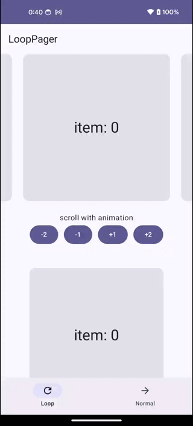

# Compose Loop Pager

Android library of a loop pager implemented by Jetpack Compose.

[](https://central.sonatype.com/artifact/com.seo4d696b75.compose/loop-pager)


## Motivation

Now [accompanist-pager](https://github.com/google/accompanist/tree/main/pager) is deprecated,
then `androidx.compose.foundation.pager`
should be used instead.
But conventional implementation of pseudo-infinite scrolling,
such as setting `pageCount = { Int.MAX_VALUE }`,
results in ANR as of 1.6.4 (BOM 2024.03.00).

## Features

[Horizontal/VerticalLoopPager](./lib/src/main/java/com/seo4d696b75/compose/pager/LoopPager.kt)

- ✅ Infinite scrolling (not pseudo implementation)
- ✅ Works properly without ANR
- ✅ Implemented without accompanist library
- ✅ Same user interaction and snap animation as `Horizontal/VerticalPager`
- ✅ Page position is savable, can be restored



## Installation

In your module level `build.gradle` file

```gradle
dependencies {
    implementation("com.seo4d696b75.compose:loop-pager:$version")
}
```

## Usage

```kotlin
val items = remember { (0..4).toList() }
val state = rememberLoopPagerState { items.size }

// minimum usage
HorizontalLoopPager(
    state = state,
    aspectRatio = 1f,
) { page ->
    val item = items[page]
    PageComposable(item)
}

// custom usage
VertivalLoopPager(
    state = state,
    aspectRatio = 1f,
    contentPadding = PaddingValues(vertical = 48.dp),
    pageSpacing = 24.dp,
    flingBehavior = LoopPagerDefaults.flingBehavior(
        state = state,
        snapAnimationSpec = tween(),
        decayAnimationSpec = exponentialDecay(),
    ),
    userScrollEnabled = true,
) { page ->
    val item = items[page]
    PageComposable(item)
}
```

## Difference with normal Pager

### In case of few pages

LoopPager is always scrollable, and same pages may be visible at one time.


### API difference

`LoopHorizontal/VerticalPager` are designed with the same interface as `Horizontal/VerticalPager`,
but some features are not supported yet.

| feature | Normal Pager | LoopPager |  
|:-----|:---------|:---------|  
| The state to control the pager | `state: PagerState` | `state: LoopPagerState` | 
| how to define page size | `pageSize: PageSize` | `aspectRatio: Float` |  
| default snap and fling animation | `PagerDefaults.flingBehavior()` | `LoopPagerDefaults.flingBehavior()` |  
| padding around the whole content | `contentPadding: PaddingValues` | ⭕️ same |  
| space betwen pages | `pageSpacing: Dp` | ⭕️ same |  
| enabled | `userScrollEnabled: Boolena` | ⭕️ same |  
| pre-load of pages | `beyondViewportPageCount: Int` | ❌️ not supported |  
| reverse scroll direction | `reverseLayout: Boolean` | ❌️ not supported |  
| nested scroll | `pageNestedScrollConnection: NestedScrollConnection` | ❌️ not supported |  
| snap posistion | `snapPosition: SnapPosition` | ❌️ not supported |  

